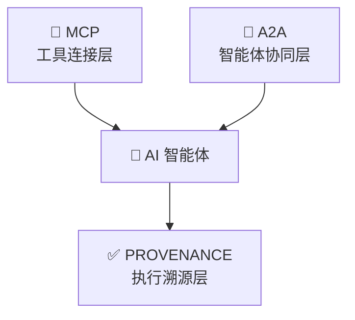
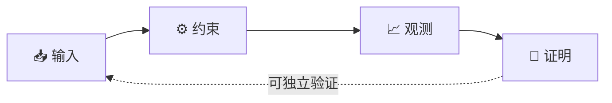

<div align="center">

# PROVENANCE 协议

[](https://github.com/provenance-protocol/spec/releases/tag/v1.0.0)
[](LICENSE)
[](https://github.com/provenance-protocol/spec/blob/main/conformance/v1/certification_criteria.md)
[](https://github.com/provenance-protocol/spec/blob/main/spec/2.0_terminology_and_notation.md)
[](GOVERNANCE.md)

> **AI 智能体的执行溯源层**  
> PROVENANCE 将概率性大语言模型推理转化为**确定性、可密码学验证的工程事件**。  
> 🔒 *无需服务器。无需密钥。无需信任。*

</div>

---

## 👋 初次访问？从这里开始：

<div align="center">

[📖 5 分钟快速入门](https://github.com/provenance-protocol/spec/blob/main/spec/1.0_abstract_and_scope.md) · 
[🧪 试用参考 CLI](https://github.com/provenance-protocol/prvn) · 
[💬 社区讨论](https://github.com/provenance-protocol/spec/discussions)

</div>

---

## 🌐 战略定位

大语言模型智能体时代已解决*连接性*（MCP）与*协同性*（A2A），但面临一个基础性缺口：**可验证性**。  
PROVENANCE 通过引入标准化、与实现解耦的**执行溯源层**，以密码学方式证明智能体*如何*、*为何*以及*在何种约束下*执行了特定行为。

### 协议栈定位



> *MCP 连接工具。A2A 协调智能体。PROVENANCE 证明执行——无需信任任何基础设施。*

PROVENANCE 采用**正交设计，非竞争关系**。它透明地部署于任何 OpenAI 兼容端点之上，捕获执行血缘、执行声明式约束，并输出防篡改的审计证明。

### PROVENANCE vs. IETF AAT

| 维度 | IETF AAT（智能体审计追踪） | PROVENANCE 协议 |
|:---|:---|:---|
| **范围** | 标准化智能体审计日志的*格式* | 标准化完整的*执行契约生命周期* |
| **核心价值** | "发生了什么"——结构化审计记录 | "如何及为何发生"——可密码学证明的执行 |
| **技术焦点** | JSON Schema、字段定义、传输规范 | 四元组契约、约束执行、JCS+SHA-256 证明 |
| **验证方式** | 假设日志基础设施可信 | 零信任：任何人可使用公开算法离线验证 |
| **可扩展性** | 固定 Schema，版本化更新 | 通过 `provenance.ai/v{major}/{feature}` 命名空间隔离扩展 |

> 💡 **核心洞察**：AAT 定义*记录什么*。PROVENANCE 定义*如何证明它*。

---

## 🧠 核心抽象：执行契约

每次大语言模型调用被标准化为可验证的四元组生命周期：

| 元组 | 语义职责 | 协议保证 |
|:---|:---|:---|
| **📥 输入** | 请求上下文快照（提示词、模型、参数） | 在 `INIT` 阶段捕获；不可变 |
| **⚙️ 约束** | 声明式执行边界（预算、隐私、可重现性） | 在 `CONSTRAINT_EVAL` 阶段评估；违规阻断上游 |
| **📈 观测** | 执行产物（Token、成本、延迟、状态跃迁） | 在 `EXECUTING` 阶段流式采集；在证明生成前完成 |
| **🔐 证明** | 契约符合性的密码学证据（JCS + SHA-256） | 在 `FINALIZED`/`FAILED` 阶段生成；支持离线验证 |



---

## 🛡️ 核心能力

| 能力 | 规范定义 | 企业价值 |
|:---|:---|:---|
| 🔐 **密码学审计** | RFC 8785 JCS + SHA-256 哈希链 | 防篡改记录；满足欧盟 AI 法案、HIPAA、SOC 2 |
| 💰 **流式预算控制** | 微美分精度原子计量 + 硬截断 | 防止无界消费；实现 AI 财务运营（FinOps） |
| 🛡️ **隐私分级** | `raw` / `masked` / `hash_only` 存储策略 | GDPR/CCPA 数据最小化；零明文合规选项 |
| 🔄 **确定性回放与差异** | 基线 - 候选对比 + 语义风险评分 | 模型回归测试；AI 发布的 CI/CD 门禁 |
| 🔌 **可扩展命名空间** | `provenance.ai/v{major}/{feature}` 隔离 | 可插拔策略引擎、内存防火墙、经济 SLA |

---

## 🔒 零信任验证保证

PROVENANCE 假设**存储、传输与执行环境均不可信**。独立验证仅需：
1. 原始 Trace JSON
2. 公开算法（RFC 8785 + SHA-256）
3. 标准密码学库

```bash
# 离线验证 Trace — 无需代理、无需 SDK、无需中心服务器
# 步骤 1：剥离非签名字段，按 RFC 8785 规范化
jq 'del(._*, .observations.internal_metrics)' trace.json | \
  python -m provenance.jcs | \
  sha256sum

# 步骤 2：与 trace.proofs.audit_signature 比对
# ✅ 匹配 = 未被篡改 | ❌ 不匹配 = 检测到篡改
```

> 💡 *审计追踪记录发生了什么。PROVENANCE 证明它。*

---

## 🌍 标准与合规对齐

PROVENANCE 为企业级互操作性与监管就绪而设计：

| 标准 / 框架 | PROVENANCE 映射 |
|:---|:---|
| **NIST AI RMF 1.0** | `constraints` → GOVERN，`observations` → MAP，`risk` → MEASURE，`audit` → MANAGE |
| **ISO/IEC 42001** | 执行生命周期与防篡改审计追踪对齐 AI 管理体系（AIMS）要求 |
| **GDPR / CCPA** | 隐私分级 + TTL 过期 + 删除审计日志满足数据最小化与被遗忘权 |
| **OpenTelemetry GenAI** | 原生 `gen_ai.*` 属性映射；通过 OTLP 导出 Span/指标 |
| **W3C PROV** | 通过 `parent_id` → `prov:wasDerivedFrom` 兼容血缘模型 |
| **OWASP LLM Top 10** | 威胁模型覆盖提示注入、无界消费、不安全输出处理 |

---

## 🗂️ 仓库地图

| 仓库 | 用途 | 语言 | 状态 |
|:---|:---|:---|:---|
| [**spec**](https://github.com/provenance-protocol/spec) | 协议规范、RFC、JSON Schema | Markdown / JSON Schema | ✅ 稳定版 v1.0.0 |
| [**prvn**](https://github.com/provenance-protocol/prvn) | 参考 CLI — 发音 *"proven"* | Go | 🚧 Beta |
| [**sdk-python**](https://github.com/provenance-protocol/sdk-python) | Python SDK，支持 OTel 导出 | Python | 🚧 Beta |
| [**validator-js**](https://github.com/provenance-protocol/validator-js) | Schema 验证与 CI 集成 | JavaScript | ✅ 稳定版 |
| [**conformance**](https://github.com/provenance-protocol/spec/tree/main/conformance/v1) | 自动化测试套件与认证标准 | Python / Shell | ✅ 活跃 |

> 🗣️ **PRVN** 发音为 **/ˈpruːvən/** — "proven"，意为"已验证的执行"。它是 PROVENANCE 协议面向开发者的工程接口。

---

## 🚀 60 秒快速开始

```bash
# 1. 安装参考 CLI（Go）
go install github.com/provenance-protocol/prvn/cmd/prvn@latest

# 2. 附带治理头运行
export OPENAI_BASE_URL="https://api.openai.com"
prvn proxy --listen :8080 --upstream "$OPENAI_BASE_URL"

# 3. 独立验证 Trace（零信任）
# 使用独立验证器（无需代理）
curl -s https://raw.githubusercontent.com/provenance-protocol/validator-js/main/verify.js | \
  node - trace.json
```

📖 [完整规范](https://github.com/provenance-protocol/spec/tree/main/spec) · 
📐 [JSON Schema](https://github.com/provenance-protocol/spec/tree/main/schemas/v1) · 
🧪 [一致性测试套件](https://github.com/provenance-protocol/spec/tree/main/conformance/v1) · 
📜 [贡献指南](https://github.com/provenance-protocol/spec/blob/main/CONTRIBUTING.md)

---

## 🏅 一致性认证

认证完全**自动化、客观、与供应商无关**。实现方通过公开测试向量即可获取认证徽章：

| 等级 | 要求 | 徽章 |
|:---|:---|:---|
| 🔵 **核心兼容** | Schema 验证 + 证明完整性 + 头部协商 | [](https://github.com/provenance-protocol/spec/blob/main/conformance/v1/certification_criteria.md) |
| 🟢 **完全兼容** | 核心 + 约束执行 + 状态机 + 错误契约 | [](https://github.com/provenance-protocol/spec/blob/main/conformance/v1/certification_criteria.md) |
| 🟡 **扩展兼容** | 完全兼容 + ≥2 项官方扩展（如 `memory_firewall`） | [](https://github.com/provenance-protocol/spec/blob/main/conformance/v1/certification_criteria.md) |

徽章链接至公开可验证的合规报告。无人工评审。无商业门槛。  
[查看已认证实现 →](https://github.com/provenance-protocol/spec/blob/main/ADOPTERS.md)

---

## ⚖️ 关键权衡

优秀的协议坦诚说明其优化目标：

| 权衡 | PROVENANCE 的立场 |
|:---|:---|
| **实时验证 vs. 最终可验证性** | 保证最终密码学可验证性；实时检查可配置 |
| **追踪完整性 vs. 智能体性能** | 追踪深度可配置，由运行时最小开销策略指导 |
| **标准合规 vs. 创新速度** | 对齐 W3C PROV 与 IETF AAT，并以密码学完整性扩展它们 |

---

## 🗓️ 协议演进

| 版本 | 日期 | 关键里程碑 |
|---------|------|---------------|
| v1.0.0 | 2026-04 | 稳定发布：核心执行契约 + 密码学审计 |
| v1.1.0 | 2026-Q3（规划中） | 批量治理 + 联邦审计链 |
| v2.0.0 | 2027+（愿景） | 后量子签名 + 零知识证明 |

> 🔄 所有 v1.x 版本保证核心字段的向后兼容性。  
> 重大变更遵循 [RFC 流程](https://github.com/provenance-protocol/spec/blob/main/GOVERNANCE.md#3-rfc-request-for-comments-process)。

---

## 📚 学术引用

如在研究中使用 PROVENANCE，请引用：

```bibtex
@misc{provenance2026,
  title={PROVENANCE: Execution Provenance Protocol for AI Agents},
  author={Lee, William and the PROVENANCE Community},
  year={2026},
  month={Apr},
  howpublished={\url{https://github.com/provenance-protocol/spec}},
  note={v1.0.0 Specification}
}
```

🔗 [arXiv 预印本](https://arxiv.org/abs/2605.xxxxx) · 
📄 [完整规范 PDF](https://github.com/provenance-protocol/spec/releases/download/v1.0.0/spec-v1.0.0.pdf)

---

## 🤝 治理与演进

PROVENANCE 遵循社区技术指导委员会（TSC）下的**开放精英治理**模型：
- 📜 **RFC 流程**：所有重大变更须经公开评议、TSC 投票与语义化版本控制
- 🔐 **知识产权政策**：Apache 2.0 许可证，含明确专利授权与无报复承诺
- 🌍 **社区驱动**：维护者提名、季度透明度报告、扩展注册表
- 🛡️ **安全**：通过 `security@provenance.ai` 负责任披露；威胁模型覆盖预算泄露、重放与供应链风险

📖 [治理文档](https://github.com/provenance-protocol/spec/blob/main/GOVERNANCE.md) · 
🔐 [知识产权政策](https://github.com/provenance-protocol/spec/blob/main/IPR-POLICY.md) · 
🐛 [安全政策](https://github.com/provenance-protocol/spec/blob/main/SECURITY.md)

---

<div align="center">

## 🌐 加入生态

[💬 讨论区](https://github.com/provenance-protocol/spec/discussions) ·
[📜 RFC 提案](https://github.com/provenance-protocol/spec/issues?q=label%3Arfc) ·
[🐛 报告问题](https://github.com/provenance-protocol/spec/issues) ·
[📖 采用指南](https://github.com/provenance-protocol/spec/blob/main/ADOPTERS.md) ·
[⭐ 收藏规范](https://github.com/provenance-protocol/spec)

> *"信任不足以为凭。你需要证明。"*

</div>

---

<div align="center" style="color: #64748b; font-size: 0.9em; margin-top: 2em;">

© 2026 PROVENANCE 协议作者。基于 [Apache License 2.0](https://github.com/provenance-protocol/spec/blob/main/LICENSE) 许可。  
**"PROVENANCE"名称与标识为 PROVENANCE 协议社区的商标。**  
PRVN 是参考实现。  
实现方在通过一致性测试后`可`声明兼容性。  
不与任何单一公司、供应商或云提供商关联。

</div>
