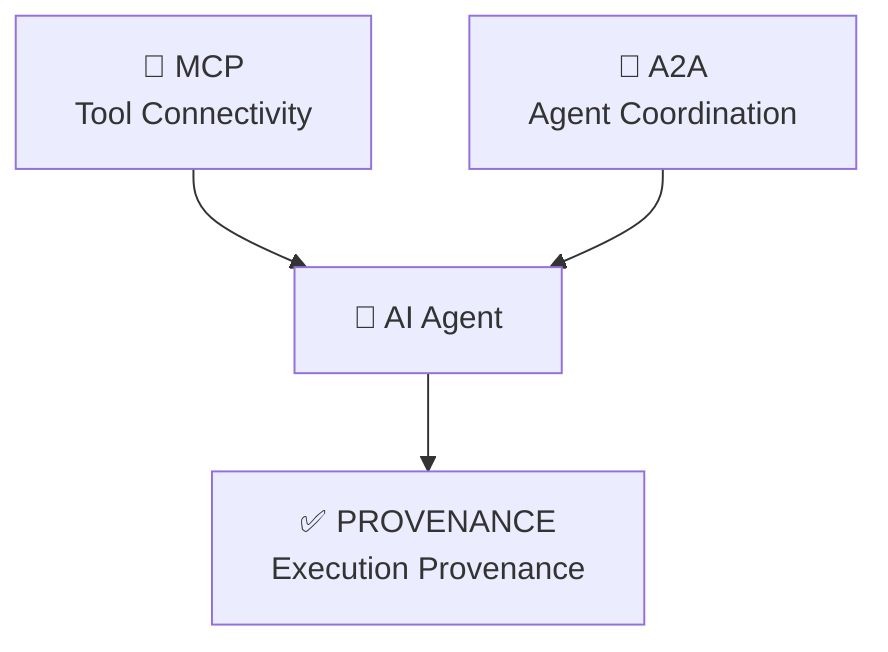
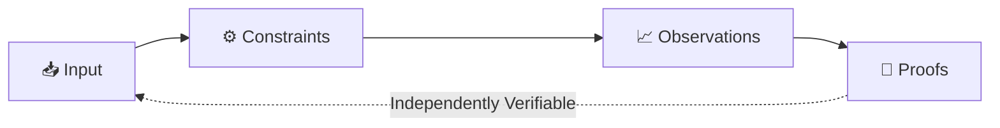

<div align="center">
    
# 📘 PROVENANCE Protocol

[](https://github.com/provenance-protocol/spec/releases/tag/v1.0.0)
[](LICENSE)
[](https://github.com/provenance-protocol/spec/blob/main/conformance/v1/certification_criteria.md)
[](https://github.com/provenance-protocol/spec/blob/main/spec/2.0_terminology_and_notation.md)
[](GOVERNANCE.md)

> **The Execution Provenance Layer for AI Agents**  
> PROVENANCE transforms probabilistic LLM inference into **deterministic, cryptographically verifiable engineering events**.  
> 🔒 *No server. No secret. No trust required.*

</div>
---

<div align="center">

### 🌐 Language / 语言

[**🇬🇧 English**](README.md) · [**🇨🇳 中文**](README-zh.md)

</div>

---

## 👋 New here? Start with:

<div align="center">

[📖 5-Minute Quick Start](https://github.com/provenance-protocol/spec/blob/main/spec/1.0_abstract_and_scope.md) · 
[🧪 Try the Reference CLI](https://github.com/provenance-protocol/prvn) · 
[💬 Ask the Community](https://github.com/provenance-protocol/spec/discussions)

</div>

---

## 🌐 Strategic Positioning

The AI Agent era has solved *connectivity* (MCP) and *coordination* (A2A). It now faces a foundational gap: **verifiability**.  
PROVENANCE fills this void by introducing a standardized, implementation-agnostic **Execution Provenance Layer** that cryptographically proves *how*, *why*, and *under what constraints* an agent acted.

### Protocol Stack



> *MCP connects tools. A2A coordinates agents. PROVENANCE proves execution — without requiring trust in any infrastructure.*

PROVENANCE is **orthogonal, not competitive**. It sits transparently atop any OpenAI-compatible endpoint, capturing execution lineage, enforcing declarative constraints, and emitting tamper-evident audit proofs.

### PROVENANCE vs. IETF AAT

| Aspect | IETF AAT (Agent Audit Trail) | PROVENANCE Protocol |
|:---|:---|:---|
| **Scope** | Standardizes audit *log format* for agent actions | Standardizes full *execution contract lifecycle* |
| **Core Value** | "What happened" — structured audit records | "How & why it happened" — cryptographically provable execution |
| **Technical Focus** | JSON schema, field definitions, transport norms | Four-tuple contract, constraint enforcement, JCS+SHA-256 proofs |
| **Verification** | Trust in logging infrastructure assumed | Zero-trust: anyone can verify offline with public algorithms |
| **Extensibility** | Fixed schema, versioned updates | Namespace-isolated extensions via `provenance.ai/v{major}/{feature}` |

> 💡 **Key Insight**: AAT defines *what to record*. PROVENANCE defines *how to prove it*.

---

## 🧠 The Core Abstraction: Execution Contract

Every LLM invocation is standardized into a verifiable four-tuple lifecycle:

| Tuple | Semantic Responsibility | Protocol Guarantee |
|:---|:---|:---|
| **📥 Input** | Request context snapshot (prompt, model, params) | Captured at `INIT`; immutable |
| **⚙️ Constraints** | Declarative execution boundaries (budget, privacy, reproducibility) | Evaluated in `CONSTRAINT_EVAL`; violations block upstream |
| **📈 Observations** | Execution artifacts (tokens, cost, latency, state transitions) | Streamed during `EXECUTING`; finalized before proof |
| **🔐 Proofs** | Cryptographic evidence of contract compliance (JCS + SHA-256) | Generated at `FINALIZED`/`FAILED`; enables offline verification |



---

## 🛡️ Key Capabilities

| Capability | Specification | Enterprise Value |
|:---|:---|:---|
| 🔐 **Cryptographic Audit** | RFC 8785 JCS + SHA-256 hash chain | Tamper-evident records; meets EU AI Act, HIPAA, SOC 2 |
| 💰 **Streaming Budget Control** | Atomic micro-cent metering with hard-stop | Prevents unbounded consumption; enables AI FinOps |
| 🛡️ **Privacy Grading** | `raw` / `masked` / `hash_only` storage | GDPR/CCPA data minimization; zero-plaintext compliance |
| 🔄 **Deterministic Replay & Diff** | Baseline-candidate comparison with semantic risk scoring | Model regression testing; CI/CD gates for AI releases |
| 🔌 **Extensible Namespacing** | `provenance.ai/v{major}/{feature}` isolation | Pluggable policy engines, memory firewalls, economic SLAs |

---

## 🔒 Zero-Trust Verification Guarantee

PROVENANCE assumes **storage, transport, and execution environments are untrusted**. Independent verification requires only:
1. The raw Trace JSON
2. Public algorithms (RFC 8785 + SHA-256)
3. A standard cryptographic library

```bash
# Verify a trace offline — no proxy, no SDK, no central server
# Step 1: Strip non-signature fields, then canonicalize per RFC 8785
jq 'del(._*, .observations.internal_metrics)' trace.json | \
  python -m provenance.jcs | \
  sha256sum

# Step 2: Compare output with trace.proofs.audit_signature
# ✅ Match = Untampered | ❌ Mismatch = Tamper detected
```

> 💡 *Audit trails record what was done. PROVENANCE proves it.*

---

## 🌍 Standards & Compliance Alignment

PROVENANCE is engineered for enterprise interoperability and regulatory readiness:

| Standard / Framework | PROVENANCE Mapping |
|:---|:---|
| **NIST AI RMF 1.0** | `constraints` → GOVERN, `observations` → MAP, `risk` → MEASURE, `audit` → MANAGE |
| **ISO/IEC 42001** | Execution lifecycle & tamper-evident audit trails align with AIMS requirements |
| **GDPR / CCPA** | Privacy grading + TTL expiry + deletion audit logs satisfy data minimization & erasure rights |
| **OpenTelemetry GenAI** | Native `gen_ai.*` attribute mapping; exports spans/metrics via OTLP |
| **W3C PROV** | Lineage model compatible via `parent_id` → `prov:wasDerivedFrom` |
| **OWASP LLM Top 10** | Threat model covers prompt injection, unbounded consumption, insecure output handling |

---

## 🗂️ Repository Map

| Repository | Purpose | Language | Status |
|:---|:---|:---|:---|
| [**spec**](https://github.com/provenance-protocol/spec) | Protocol specification, RFCs, JSON Schemas | Markdown / JSON Schema | ✅ Stable v1.0.0 |
| [**prvn**](https://github.com/provenance-protocol/prvn) | Reference CLI — pronounced *"proven"* | Go | 🚧 Beta |
| [**sdk-python**](https://github.com/provenance-protocol/sdk-python) | Python SDK with OTel export | Python | 🚧 Beta |
| [**validator-js**](https://github.com/provenance-protocol/validator-js) | Schema validation & CI integration | JavaScript | ✅ Stable |
| [**conformance**](https://github.com/provenance-protocol/spec/tree/main/conformance/v1) | Automated test suite & certification criteria | Python / Shell | ✅ Active |

> 🗣️ **PRVN** is pronounced **/ˈpruːvən/** — "proven", as in "proven execution". It is the developer-facing engineering interface of the PROVENANCE Protocol.

---

## 🚀 Get Started in 60 Seconds

```bash
# 1. Install reference CLI (Go)
go install github.com/provenance-protocol/prvn/cmd/prvn@latest

# 2. Run with governance headers
export OPENAI_BASE_URL="https://api.openai.com"
prvn proxy --listen :8080 --upstream "$OPENAI_BASE_URL"

# 3. Verify trace independently (zero trust)
# Using the standalone validator (no proxy required)
curl -s https://raw.githubusercontent.com/provenance-protocol/validator-js/main/verify.js | \
  node - trace.json
```

📖 [Full Specification](https://github.com/provenance-protocol/spec/tree/main/spec) · 
📐 [JSON Schemas](https://github.com/provenance-protocol/spec/tree/main/schemas/v1) · 
🧪 [Conformance Suite](https://github.com/provenance-protocol/spec/tree/main/conformance/v1) · 
📜 [Contributing Guide](https://github.com/provenance-protocol/spec/blob/main/CONTRIBUTING.md)

---

## 🏅 Conformance Certification

Certification is **fully automated, objective, and vendor-neutral**. Implementations earn badges by passing public test vectors:

| Tier | Requirements | Badge |
|:---|:---|:---|
| 🔵 **Core Compatible** | Schema validation + Proof integrity + Header negotiation | [](https://github.com/provenance-protocol/spec/blob/main/conformance/v1/certification_criteria.md) |
| 🟢 **Full Compatible** | Core + Constraint enforcement + State machine + Error contract | [](https://github.com/provenance-protocol/spec/blob/main/conformance/v1/certification_criteria.md) |
| 🟡 **Extended Compatible** | Full + ≥2 official extensions (e.g., `memory_firewall`) | [](https://github.com/provenance-protocol/spec/blob/main/conformance/v1/certification_criteria.md) |

Badges link to publicly verifiable compliance reports. No manual review. No commercial gatekeeping.  
[View Certified Implementations →](https://github.com/provenance-protocol/spec/blob/main/ADOPTERS.md)

---

## ⚖️ Key Tradeoffs

Great protocols are honest about what they optimize for:

| Tradeoff | PROVENANCE's Stance |
|:---|:---|
| **Real-time vs. eventual verifiability** | Guarantees eventual cryptographic verifiability; real-time checks are configurable |
| **Trace completeness vs. agent performance** | Trace depth is configurable, guided by minimal-overhead policy at runtime |
| **Standard compliance vs. innovation speed** | Aligns with W3C PROV and IETF AAT, extending them with cryptographic integrity |

---

## 🗓️ Protocol Evolution

| Version | Date | Key Milestone |
|---------|------|---------------|
| v1.0.0 | 2026-04 | Stable release: Core execution contract + cryptographic audit |
| v1.1.0 | 2026-Q3 (planned) | Batch governance + federated audit chains |
| v2.0.0 | 2027+ (vision) | Post-quantum signatures + zero-knowledge proofs |

> 🔄 All v1.x releases guarantee backward compatibility for core fields.  
> Major changes follow the [RFC process](https://github.com/provenance-protocol/spec/blob/main/GOVERNANCE.md#3-rfc-request-for-comments-process).

---

## 📚 Academic Citation

If you use PROVENANCE in research, please cite:

```bibtex
@misc{provenance2026,
  title={PROVENANCE: Execution Provenance Protocol for AI Agents},
  author={Lee, William and the PROVENANCE Community},
  year={2026},
  month={Apr},
  howpublished={\url{https://github.com/provenance-protocol/spec}},
  note={v1.0.0 Specification}
}
```

🔗 [Preprint on arXiv](https://arxiv.org/abs/2605.xxxxx) · 
📄 [Full Specification PDF](https://github.com/provenance-protocol/spec/releases/download/v1.0.0/spec-v1.0.0.pdf)

---

## 🤝 Governance & Evolution

PROVENANCE follows an **Open Meritocracy** model under a community Technical Steering Committee (TSC):
- 📜 **RFC Process**: All major changes undergo public review, TSC voting, and semantic versioning
- 🔐 **IPR Policy**: Apache 2.0 with explicit patent grant & no-retaliation pledge
- 🌍 **Community-Driven**: Maintainer nomination, quarterly transparency reports, extension registry
- 🛡️ **Security**: Responsible disclosure via `security@provenance.ai`; threat model covers BudgetLeak, replay, and supply-chain risks

📖 [GOVERNANCE.md](https://github.com/provenance-protocol/spec/blob/main/GOVERNANCE.md) · 
🔐 [IPR-POLICY.md](https://github.com/provenance-protocol/spec/blob/main/IPR-POLICY.md) · 
🐛 [SECURITY.md](https://github.com/provenance-protocol/spec/blob/main/SECURITY.md)

---

<div align="center">

## 🌐 Join the Ecosystem

[💬 Discussions](https://github.com/provenance-protocol/spec/discussions) ·
[📜 RFC Proposals](https://github.com/provenance-protocol/spec/issues?q=label%3Arfc) ·
[🐛 Report Bug](https://github.com/provenance-protocol/spec/issues) ·
[📖 Adoption Guide](https://github.com/provenance-protocol/spec/blob/main/ADOPTERS.md) ·
[⭐ Star the Spec](https://github.com/provenance-protocol/spec)

> *"Trust is not enough. You need proof."*

</div>

---

<div align="center" style="color: #64748b; font-size: 0.9em; margin-top: 2em;">

© 2026 PROVENANCE Protocol Authors. Licensed under [Apache License 2.0](https://github.com/provenance-protocol/spec/blob/main/LICENSE).  
**The "PROVENANCE" name and logo are marks of the PROVENANCE Protocol community.**  
PRVN is the reference implementation.  
Implementations `MAY` declare compatibility upon passing conformance tests.  
Not affiliated with any single company, vendor, or cloud provider.

</div>
